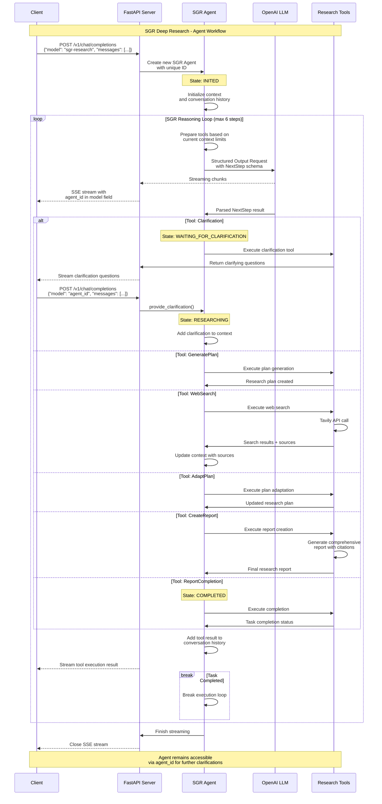

# 🧠 SGR Deep Research - Open-Source Schema-Guided Reasoning System

https://github.com/user-attachments/assets/a5e34116-7853-43c2-ba93-2db811b8584a

Production-ready open-source system for automated research using Schema-Guided Reasoning (SGR). Features real-time streaming responses, OpenAI-compatible API, and comprehensive research capabilities with agent interruption support.

## 👥 Open-Source Development Team

This project is built by the community with pure enthusiasm as an open-source initiative:

- **SGR Concept Creator**: [@abdullin](https://t.me/llm_under_hood) - Original Schema-Guided Reasoning concept
- **Project Coordinator & Vision**: [@VaKovaLskii](https://t.me/neuraldeep) - Team coordination and project direction  
- **Lead Core Developer**: [@virrius](https://t.me/virrius_tech) - Complete system rewrite and core implementation
- **API Development**: [Pavel Zloi](https://t.me/evilfreelancer) - OpenAI-compatible API layer
- **Hybrid FC Mode**: [@Shadekss](https://t.me/Shadekss) - Dmitry Sirakov [Shade] - SGR integration into Function Calling for Agentic-capable models
- **DevOps & Deployment**: [@mixaill76](https://t.me/mixaill76) - Infrastructure and build management

*All development is driven by pure enthusiasm and open-source community collaboration. We welcome contributors of all skill levels!*

## 📁 Project Structure

```
sgr-deep-research/
├── src/                     # 🎯 Main application source
│   ├── api/                 # 🌐 FastAPI endpoints and models
│   │   ├── endpoints.py     # OpenAI-compatible API routes
│   │   └── models.py        # Pydantic models for API
│   ├── core/                # 🧠 Core SGR logic
│   │   ├── agent.py         # Main SGR research agent with streaming
│   │   ├── models.py        # Agent state and context models
│   │   ├── prompts.py       # Prompt loading and management
│   │   ├── reasoning_schemas.py  # SGR reasoning schemas
│   │   ├── stream.py        # OpenAI-compatible streaming
│   │   └── tools.py         # Research tools and execution
│   ├── services/            # 🔧 External integrations
│   │   └── tavily_search.py # Tavily search service
│   ├── prompts/             # 📝 System prompts
│   │   ├── system_prompt.txt     # Main system prompt
│   │   └── tool_function_prompt.txt  # Tool selection guidance
│   ├── main.py              # 🚀 FastAPI application entry point
│   ├── settings.py          # ⚙️ Configuration management
│   ├── pyproject.toml       # 📦 Dependencies & project config
│   ├── config.yaml.example # 📝 Configuration template
│   └── Dockerfile          # 🐳 Container configuration
├── reports/                 # 📊 Generated research reports
├── docker-compose.yml      # 🐳 Docker deployment
└── README.md               # 📖 This documentation
```

## 🚀 Quick Start

### Prerequisites
First, install UV (modern Python package manager):
```bash
# Install UV
curl -LsSf https://astral.sh/uv/install.sh | sh
# or on Windows:
# powershell -ExecutionPolicy ByPass -c "irm https://astral.sh/uv/install.ps1 | iex"
```

### Local Development
```bash
# 1. Setup configuration
cp src/config.yaml.example src/config.yaml
# Edit src/config.yaml with your API keys

# 2. Change to src directory and install dependencies
cd src
uv sync

# 3. Run the server
uv run python main.py
```

### Docker Deployment
```bash
# 1. Setup configuration
cp src/config.yaml.example src/config.yaml
# Edit src/config.yaml with your API keys

# 2. Deploy with Docker Compose
docker-compose up -d

# 3. Check health
curl http://localhost:8010/health
```

## 🌐 OpenAI-Compatible API

The system provides a fully OpenAI-compatible API with advanced agent interruption and clarification capabilities.

### Basic Research Request
```bash
curl -X POST "http://localhost:8010/v1/chat/completions" \
  -H "Content-Type: application/json" \
  -d '{
    "model": "sgr-research",
    "messages": [{"role": "user", "content": "Research BMW X6 2025 prices in Russia"}],
    "stream": true,
    "max_tokens": 1500,
    "temperature": 0.4
  }'
```

### 🔄 Agent Interruption & Clarification Flow

When the agent needs clarification, it returns a unique agent ID in the streaming response model field. You can then continue the conversation using this agent ID.

#### Step 1: Initial Request
```bash
curl -X POST "http://localhost:8010/v1/chat/completions" \
  -H "Content-Type: application/json" \
  -d '{
    "model": "sgr-research",
    "messages": [{"role": "user", "content": "Research AI market trends"}],
    "stream": true,
    "max_tokens": 1500,
    "temperature": 0
  }'
```

#### Step 2: Agent Requests Clarification
The streaming response includes the agent ID in the model field:
```json
{
  "model": "sgr_agent_b84d5a01-c394-4499-97be-dad6a5d2cb86",
  "choices": [{
    "delta": {
      "tool_calls": [{
        "function": {
          "name": "clarification",
          "arguments": "{\"questions\":[\"Which specific AI market segment are you interested in (LLM, computer vision, robotics)?\", \"What time period should I focus on (2024, next 5 years)?\", \"Are you looking for global trends or specific geographic regions?\", \"Do you need technical analysis or business/investment perspective?\"]}"
        }
      }]
    }
  }]
}
```

#### Step 3: Continue with Agent ID
```bash
curl -X POST "http://localhost:8010/v1/chat/completions" \
  -H "Content-Type: application/json" \
  -d '{
    "model": "sgr_agent_b84d5a01-c394-4499-97be-dad6a5d2cb86",
    "messages": [{"role": "user", "content": "Focus on LLM market trends for 2024-2025, global perspective, business analysis"}],
    "stream": true,
    "max_tokens": 1500,
    "temperature": 0
  }'
```

### Agent Management
```bash
# Get all active agents
curl http://localhost:8010/agents

# Get specific agent state
curl http://localhost:8010/agents/{agent_id}/state

# Direct clarification endpoint
curl -X POST "http://localhost:8010/agents/{agent_id}/provide_clarification" \
  -H "Content-Type: application/json" \
  -d '{
    "messages": [{"role": "user", "content": "Focus on luxury models only"}],
    "stream": true
  }'
```

## 📊 SGR Agent Workflow

### Agent Execution Sequence

The following diagram shows the complete SGR agent workflow with interruption and clarification support:



### Schema-Guided Reasoning Capabilities:
1. **🤔 Clarification** - clarifying questions when unclear
2. **📋 Plan Generation** - research plan creation  
3. **🔍 Web Search** - internet information search
4. **🔄 Plan Adaptation** - plan adaptation based on results
5. **📝 Report Creation** - detailed report creation
6. **✅ Completion** - task completion

### Example Research Tasks:
- "Find information about BMW X6 2025 prices in Russia"
- "Research current AI trends"
- "Analyze cryptocurrency market in 2024"

## 🧠 SGR vs Function Calling: When to Use Each Approach

### The Problem with Function Calling on Local Models (ReAct Agents)

**Reality Check:** Function Calling works great on OpenAI/Anthropic (80+ [BFCL](https://gorilla.cs.berkeley.edu/leaderboard.html) scores) but fails dramatically on local models <32B parameters when using true ReAct agents with `tool_mode="auto"`, where the model itself decides when to call tools.

**BFCL Benchmark Results for Qwen3 Models:**
- `Qwen3-8B (FC)`: Only 15% accuracy in Agentic Web Search mode ([BFCL](https://gorilla.cs.berkeley.edu/leaderboard.html) benchmark)
- `Qwen3-4B (FC)`: Only 2% accuracy in Agentic Web Search mode
- `Qwen3-1.7B (FC)`: Only 4.5% accuracy in Agentic Web Search mode
- Even with native FC support, smaller models struggle with deciding **WHEN** to call tools
- Common result: `{"tool_calls": null, "content": "Text instead of tool call"}`

**Note:** Our team is currently working on creating a specialized benchmark for SGR vs ReAct performance on smaller models. Initial testing confirms that the SGR pipeline enables even smaller models to follow complex task workflows.

### SGR Solution: Forced Reasoning → Deterministic Execution

```python
# Phase 1: Structured Output reasoning (100% reliable)
reasoning = model.generate(format="json_schema")
# {"action": "search", "query": "BMW X6 prices", "reason": "need current data"}

# Phase 2: Deterministic execution (no model uncertainty)  
result = execute_plan(reasoning.actions)
```

### Architecture by Model Size

| Model Size | Recommended Approach | FC Accuracy | Why Choose This |
|------------|---------------------|------------|-----------------|
| **<14B** | Pure SGR + Structured Output | 15-25% | FC practically unusable |
| **14-32B** | SGR + FC hybrid | 45-65% | Best of both worlds |
| **32B+** | Native FC with SGR fallback | 85%+ | FC works reliably |

### When to Use SGR vs Function Calling

| Use Case | Best Approach | Why |
|----------|--------------|-----|
| **Data analysis & structuring** | SGR | Controlled reasoning with visibility |
| **Document processing** | SGR | Step-by-step analysis with justification |
| **Local models (<32B)** | SGR | Forces reasoning regardless of model limitations |
| **Multi-agent systems** | Function Calling | Native agent interruption support |
| **External API interactions** | Function Calling | Direct tool access pattern |
| **Production monitoring** | SGR | All reasoning steps visible and loggable |

### Real-World Results

**Initial Testing Results:**
- SGR enables even small models to follow structured workflows
- SGR pipeline provides deterministic execution regardless of model size
- SGR forces reasoning steps that ReAct leaves to model discretion

**Planned Benchmarking:**
- We're developing a comprehensive benchmark comparing SGR vs ReAct across model sizes
- Initial testing shows promising results for SGR on models as small as 4B parameters
- Full metrics and performance comparison coming soon

### Hybrid Approach: The Best of Both Worlds

The optimal solution for many production systems is a hybrid approach:

1. **SGR for decision making** - Determine which tools to use
2. **Function Calling for execution** - Get data and provide agent-like experience
3. **SGR for final processing** - Structure and format results

This hybrid approach works particularly well for models in the 14-32B range, where Function Calling works sometimes but isn't fully reliable.

**Bottom Line:** Don't force <32B models to pretend they're GPT-4o in ReAct-style agentic workflows with `tool_mode="auto"`. Let them think structurally through SGR, then execute deterministically.

## ⚙️ Configuration

### Setup Configuration File
1. **Create config.yaml from template:**
```bash
cp config.yaml.example config.yaml
```

2. **Configure API keys:**
```yaml
# OpenAI API Configuration
openai:
  api_key: "your-openai-api-key-here"  # Required: Your OpenAI API key
  base_url: ""                         # Optional: Alternative URL (e.g., for proxy LiteLLM/vLLM)
  model: "gpt-4o-mini"                 # Model to use
  max_tokens: 8000                     # Maximum number of tokens
  temperature: 0.4                     # Generation temperature (0.0-1.0)

tavily:
  api_key: "your-tavily-api-key-here"

search:
  max_results: 10

scraping:
  enabled: false
  max_pages: 5
  content_limit: 1500

execution:
  max_steps: 6
  reports_dir: "reports"
```

### Environment Variables (Alternative)
```bash
export OPENAI_API_KEY="your-openai-key"
export TAVILY_API_KEY="your-tavily-key"
export HOST="0.0.0.0"
export PORT="8010"
```

### Server Configuration
```bash
# Custom host and port
python main.py --host 127.0.0.1 --port 8080

# Custom config file
python main.py --app_config /path/to/config.yaml
```

## 📝 Reports

Research reports are automatically saved to the `reports/` directory in Markdown format:
```
reports/YYYYMMDD_HHMMSS_Task_Name.md
```

### Report Structure
- 📋 **Executive Summary** - Key insights overview
- 🔍 **Technical Analysis** - Detailed findings with citations
- 📊 **Key Findings** - Main conclusions
- 📎 **Sources** - All reference links

### Example Report
See `example_report.md` for a complete sample of SGR research output.

## 🔗 Integration Examples

### Python Client
```python
import httpx

async def research_query(query: str):
    async with httpx.AsyncClient() as client:
        async with client.stream(
            "POST",
            "http://localhost:8010/v1/chat/completions",
            json={
                "messages": [{"role": "user", "content": query}],
                "stream": True
            }
        ) as response:
            async for chunk in response.aiter_text():
                print(chunk, end="")
```

### Curl with Streaming
```bash
curl -N -X POST "http://localhost:8010/v1/chat/completions" \
  -H "Content-Type: application/json" \
  -d '{
    "messages": [{"role": "user", "content": "Research current AI trends"}],
    "stream": true
  }'
```

### Agent State Monitoring
```python
import httpx

async def monitor_agent(agent_id: str):
    async with httpx.AsyncClient() as client:
        response = await client.get(f"http://localhost:8010/agents/{agent_id}/state")
        state = response.json()
        
        print(f"Task: {state['task']}")
        print(f"State: {state['state']}")
        print(f"Searches used: {state['searches_used']}")
        print(f"Sources found: {state['sources_count']}")
```

## 🚦 Health Check & Monitoring

### Health Endpoint
```bash
curl http://localhost:8010/health
```


### Production Readiness
- ✅ **Structured logging** with proper log levels
- ✅ **Health checks** for container orchestration  
- ✅ **Graceful error handling** with HTTPException
- ✅ **Async/await** throughout for performance
- ✅ **Pydantic validation** for all inputs/outputs
- ✅ **Environment variable** support
- ✅ **Docker containerization** with multi-stage builds

## 🎯 Example Research Tasks

The SGR system excels at various research scenarios:

- **Market Research**: "Analyze BMW X6 2025 pricing across European markets"
- **Technology Trends**: "Research current developments in quantum computing"
- **Competitive Analysis**: "Compare features of top 5 CRM systems in 2024"
- **Industry Reports**: "Investigate renewable energy adoption in Germany"

## 🚀 Future Development Plans

Our team is actively working on several exciting enhancements to the SGR Deep Research platform:

### 🔄 Hybrid Mode Integration
- Implementing a hybrid SGR+FC mode directly in the current functionality
- Allowing seamless switching between SGR and Function Calling based on model capabilities
- Optimizing performance for mid-range models (14-32B parameters)

### 📊 Comprehensive Benchmarking
- Developing a specialized benchmark suite for comparing SGR vs ReAct approaches
- Testing across various model sizes and architectures
- Measuring performance, accuracy, and reliability metrics

### 🧠 MCP Functionality
- Adding support for [Machine Cognitive Protocol (MCP)](https://github.com/anthropics/anthropic-cookbook/tree/main/mcp) functionality
- Standardizing agent tooling and reasoning interfaces
- Enhancing interoperability with other agent frameworks

## 🤝 Open-Source Contributing

We welcome contributions from the community! SGR Deep Research is an open-source project designed as a production-ready service with extensible architecture.

### How to Contribute

1. **Fork the repository**
2. **Create a feature branch**
   ```bash
   git checkout -b feature/your-feature-name
   ```
3. **Make your changes**
4. **Test thoroughly**
   ```bash
   cd src
   uv sync
   uv run python main.py
   # Test your changes
   ```
5. **Submit a pull request**

### Architecture Extension Points

The current architecture supports:

- **Extensible reasoning schemas** in `src/core/reasoning_schemas.py`
- **Pluggable search services** in `src/services/`
- **Clean API interfaces** with comprehensive models
- **Streaming responses** for real-time user experience

### Areas for Contribution

- 🧠 **New reasoning schemas** for specialized research domains
- 🔍 **Additional search providers** (Google, Bing, etc.)
- 🛠️ **Tool integrations** (databases, APIs, file systems)
- 📊 **Enhanced reporting formats** (PDF, HTML, structured data)
- 🔧 **Performance optimizations** and caching strategies

---

🧠 **Production-ready Schema-Guided Reasoning for automated research!**
