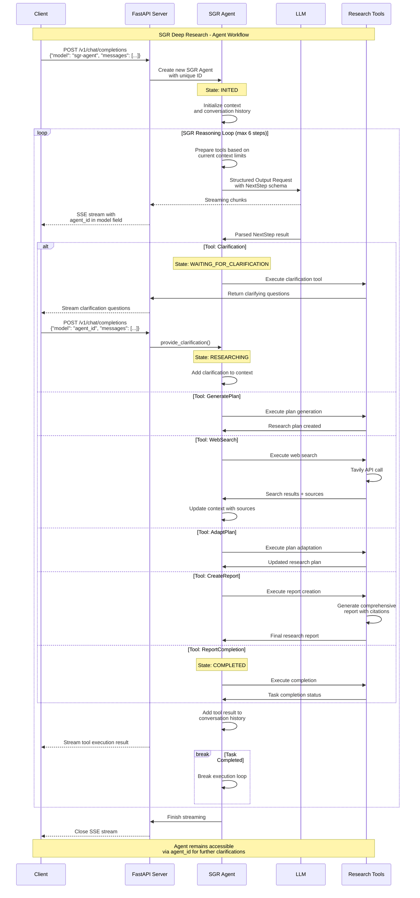

# 🧠 SGR Deep Research - Open-Source Schema-Guided Reasoning System

Web Interface Video

https://github.com/user-attachments/assets/9e1c46c0-0c13-45dd-8b35-a3198f946451

Terminal CLI Video

https://github.com/user-attachments/assets/a5e34116-7853-43c2-ba93-2db811b8584a

Production-ready open-source system for automated research using Schema-Guided Reasoning (SGR). Features real-time streaming responses, OpenAI-compatible API, and comprehensive research capabilities with agent interruption support.

## 📊 Summary Table of Agents

| Agent                   | SGR Implementation | ReasoningTool        | Tools                 | API Requests | Selection Mechanism |
| ----------------------- | ------------------ | -------------------- | --------------------- | ------------ | ------------------- |
| **1. SGR-Agent**        | Structured Output  | ❌ Built into schema | 6 basic               | 1            | SO Union Type       |
| **2. FCAgent**          | ❌ Absent          | ❌ Absent            | 6 basic               | 1            | FC "required"       |
| **3. HybridSGRAgent**   | FC Tool enforced   | ✅ First step FC     | 7 (6 + ReasoningTool) | 2            | FC → FC             |
| **4. OptionalSGRAgent** | FC Tool optional   | ✅ At model’s choice | 7 (6 + ReasoningTool) | 1–2          | FC "auto"           |
| **5. ReasoningFC_SO**   | FC → SO → FC auto  | ✅ FC enforced       | 7 (6 + ReasoningTool) | 3            | FC → SO → FC auto   |

## 👥 Open-Source Development Team

This project is built by the community with pure enthusiasm as an open-source initiative:

- **SGR Concept Creator**: [@abdullin](https://t.me/llm_under_hood) - Original Schema-Guided Reasoning concept
- **Project Coordinator & Vision**: [@VaKovaLskii](https://t.me/neuraldeep) - Team coordination and project direction
- **Lead Core Developer**: [@virrius](https://t.me/virrius_tech) - Complete system rewrite and core implementation
- **API Development**: [Pavel Zloi](https://t.me/evilfreelancer) - OpenAI-compatible API layer
- **Hybrid FC Mode**: [@Shadekss](https://t.me/Shadekss) - Dmitry Sirakov \[Shade\] - SGR integration into Function Calling for Agentic-capable models
- **DevOps & Deployment**: [@mixaill76](https://t.me/mixaill76) - Infrastructure and build management

*All development is driven by pure enthusiasm and open-source community collaboration. We welcome contributors of all skill levels!*

## 🚀 Quick Start

### Prerequisites

First, install UV (modern Python package manager):

```bash
# Install UV
curl -LsSf https://astral.sh/uv/install.sh | sh
# or on Windows:
# powershell -ExecutionPolicy ByPass -c "irm https://astral.sh/uv/install.ps1 | iex"
```

### Local Development

```bash
# 1. Setup configuration
cp config.yaml.example config.yaml
# Edit config.yaml with your API keys

# 2. Change to src directory and install dependencies
uv sync

# 3. Run the server
uv run python sgr_deep_research
```

### Docker Deployment

```bash
# 1. Setup configuration
cp config.yaml.example config.yaml
# Edit config.yaml with your API keys

# 2. Go to the services folder
cd services

# 3. Building docker images
docker-compose build

# 4. Deploy with Docker Compose
docker-compose up -d

# 3. Check health
curl http://localhost:8010/health
```

______________________________________________________________________

## 📚 Integration & Examples

<details>
<summary>🚀 <strong>Python OpenAI Client Examples</strong> - Complete integration guide with streaming & clarifications</summary>

Simple Python examples for using OpenAI client with SGR Deep Research system.

## Prerequisites

```bash
pip install openai
```

## Example 1: Basic Research Request

Simple research query without clarifications.

```python
from openai import OpenAI

# Initialize client
client = OpenAI(
    base_url="http://localhost:8010/v1",
    api_key="dummy",  # Not required for local server
)

# Make research request
response = client.chat.completions.create(
    model="sgr-agent",
    messages=[{"role": "user", "content": "Research BMW X6 2025 prices in Russia"}],
    stream=True,
    temperature=0.4,
)

# Print streaming response
for chunk in response:
    if chunk.choices[0].delta.content:
        print(chunk.choices[0].delta.content, end="")
```

## Example 2: Research with Clarification Support

Handle agent clarification requests and continue conversation.

```python
import json
from openai import OpenAI

client = OpenAI(base_url="http://localhost:8010/v1", api_key="dummy")

# Step 1: Initial research request
print("Starting research...")
response = client.chat.completions.create(
    model="sgr-agent",
    messages=[{"role": "user", "content": "Research AI market trends"}],
    stream=True,
    temperature=0,
)

agent_id = None
clarification_questions = []

# Process streaming response
for chunk in response:
    # Extract agent ID from model field
    if chunk.model and chunk.model.startswith("sgr_agent_"):
        agent_id = chunk.model
        print(f"\nAgent ID: {agent_id}")

    # Check for clarification requests
    if chunk.choices[0].delta.tool_calls:
        for tool_call in chunk.choices[0].delta.tool_calls:
            if tool_call.function and tool_call.function.name == "clarification":
                args = json.loads(tool_call.function.arguments)
                clarification_questions = args.get("questions", [])

    # Print content
    if chunk.choices[0].delta.content:
        print(chunk.choices[0].delta.content, end="")

# Step 2: Handle clarification if needed
if clarification_questions and agent_id:
    print(f"\n\nClarification needed:")
    for i, question in enumerate(clarification_questions, 1):
        print(f"{i}. {question}")

    # Provide clarification
    clarification = "Focus on LLM market trends for 2024-2025, global perspective"
    print(f"\nProviding clarification: {clarification}")

    # Continue with agent ID
    response = client.chat.completions.create(
        model=agent_id,  # Use agent ID as model
        messages=[{"role": "user", "content": clarification}],
        stream=True,
        temperature=0,
    )

    # Print final response
    for chunk in response:
        if chunk.choices[0].delta.content:
            print(chunk.choices[0].delta.content, end="")

print("\n\nResearch completed!")
```

## Usage Notes

- Replace `localhost:8010` with your server URL
- The `api_key` can be any string for local server
- Agent ID is returned in the `model` field during streaming
- Clarification questions are sent via `tool_calls` with function name `clarification`
- Use the agent ID as model name to continue conversation

</details>

______________________________________________________________________

<details>
<summary>⚡ <strong>cURL API Examples</strong> - Direct HTTP requests with agent interruption & clarification flow</summary>

The system provides a fully OpenAI-compatible API with advanced agent interruption and clarification capabilities.

### Basic Research Request

```bash
curl -X POST "http://localhost:8010/v1/chat/completions" \
  -H "Content-Type: application/json" \
  -d '{
    "model": "sgr-agent",
    "messages": [{"role": "user", "content": "Research BMW X6 2025 prices in Russia"}],
    "stream": true,
    "max_tokens": 1500,
    "temperature": 0.4
  }'
```

### 🔄 Agent Interruption & Clarification Flow

When the agent needs clarification, it returns a unique agent ID in the streaming response model field. You can then continue the conversation using this agent ID.

#### Step 1: Initial Request

```bash
curl -X POST "http://localhost:8010/v1/chat/completions" \
  -H "Content-Type: application/json" \
  -d '{
    "model": "sgr-agent",
    "messages": [{"role": "user", "content": "Research AI market trends"}],
    "stream": true,
    "max_tokens": 1500,
    "temperature": 0
  }'
```

#### Step 2: Agent Requests Clarification

The streaming response includes the agent ID in the model field:

```json
{
  "model": "sgr_agent_b84d5a01-c394-4499-97be-dad6a5d2cb86",
  "choices": [{
    "delta": {
      "tool_calls": [{
        "function": {
          "name": "clarification",
          "arguments": "{\"questions\":[\"Which specific AI market segment are you interested in (LLM, computer vision, robotics)?\", \"What time period should I focus on (2024, next 5 years)?\", \"Are you looking for global trends or specific geographic regions?\", \"Do you need technical analysis or business/investment perspective?\"]}"
        }
      }]
    }
  }]
}
```

#### Step 3: Continue with Agent ID

```bash
curl -X POST "http://localhost:8010/v1/chat/completions" \
  -H "Content-Type: application/json" \
  -d '{
    "model": "sgr_agent_b84d5a01-c394-4499-97be-dad6a5d2cb86",
    "messages": [{"role": "user", "content": "Focus on LLM market trends for 2024-2025, global perspective, business analysis"}],
    "stream": true,
    "max_tokens": 1500,
    "temperature": 0
  }'
```

### Agent Management

```bash
# Get all active agents
curl http://localhost:8010/agents

# Get specific agent state
curl http://localhost:8010/agents/{agent_id}/state

# Direct clarification endpoint
curl -X POST "http://localhost:8010/agents/{agent_id}/provide_clarification" \
  -H "Content-Type: application/json" \
  -d '{
    "messages": [{"role": "user", "content": "Focus on luxury models only"}],
    "stream": true
  }'
```

</details>

______________________________________________________________________

## 📊 SGR Agent Workflow

### Agent Execution Sequence

The following diagram shows the complete SGR agent workflow with interruption and clarification support:



### Schema-Guided Reasoning Capabilities:

1. **🤔 Clarification** - clarifying questions when unclear
2. **📋 Plan Generation** - research plan creation
3. **🔍 Web Search** - internet information search
4. **🔄 Plan Adaptation** - plan adaptation based on results
5. **📝 Report Creation** - detailed report creation
6. **✅ Completion** - task completion

## 🧠 SGR vs Function Calling: When to Use Each Approach

### The Problem with Function Calling on Local Models (ReAct Agents)

**Reality Check:** Function Calling works great on OpenAI/Anthropic (80+ [BFCL](https://gorilla.cs.berkeley.edu/leaderboard.html) scores) but fails dramatically on local models \<32B parameters when using true ReAct agents with `tool_mode="auto"`, where the model itself decides when to call tools.

**BFCL Benchmark Results for Qwen3 Models:**

- `Qwen3-8B (FC)`: Only 15% accuracy in Agentic Web Search mode ([BFCL](https://gorilla.cs.berkeley.edu/leaderboard.html) benchmark)
- `Qwen3-4B (FC)`: Only 2% accuracy in Agentic Web Search mode
- `Qwen3-1.7B (FC)`: Only 4.5% accuracy in Agentic Web Search mode
- Even with native FC support, smaller models struggle with deciding **WHEN** to call tools
- Common result: `{"tool_calls": null, "content": "Text instead of tool call"}`

**Note:** Our team is currently working on creating a specialized benchmark for SGR vs ReAct performance on smaller models. Initial testing confirms that the SGR pipeline enables even smaller models to follow complex task workflows.

### SGR Solution: Forced Reasoning → Deterministic Execution

```python
# Phase 1: Structured Output reasoning (100% reliable)
reasoning = model.generate(format="json_schema")
# {"action": "search", "query": "BMW X6 prices", "reason": "need current data"}

# Phase 2: Deterministic execution (no model uncertainty)
result = execute_plan(reasoning.actions)
```

### Architecture by Model Size

| Model Size | Recommended Approach         | FC Accuracy | Why Choose This         |
| ---------- | ---------------------------- | ----------- | ----------------------- |
| **\<14B**  | Pure SGR + Structured Output | 15-25%      | FC practically unusable |
| **14-32B** | SGR + FC hybrid              | 45-65%      | Best of both worlds     |
| **32B+**   | Native FC with SGR fallback  | 85%+        | FC works reliably       |

### When to Use SGR vs Function Calling

| Use Case                        | Best Approach    | Why                                              |
| ------------------------------- | ---------------- | ------------------------------------------------ |
| **Data analysis & structuring** | SGR              | Controlled reasoning with visibility             |
| **Document processing**         | SGR              | Step-by-step analysis with justification         |
| **Local models (\<32B)**        | SGR              | Forces reasoning regardless of model limitations |
| **Multi-agent systems**         | Function Calling | Native agent interruption support                |
| **External API interactions**   | Function Calling | Direct tool access pattern                       |
| **Production monitoring**       | SGR              | All reasoning steps visible and loggable         |

### Real-World Results

**Initial Testing Results:**

- SGR enables even small models to follow structured workflows
- SGR pipeline provides deterministic execution regardless of model size
- SGR forces reasoning steps that ReAct leaves to model discretion

**Planned Benchmarking:**

- We're developing a comprehensive benchmark comparing SGR vs ReAct across model sizes
- Initial testing shows promising results for SGR on models as small as 4B parameters
- Full metrics and performance comparison coming soon

### Hybrid Approach: The Best of Both Worlds

The optimal solution for many production systems is a hybrid approach:

1. **SGR for decision making** - Determine which tools to use
2. **Function Calling for execution** - Get data and provide agent-like experience
3. **SGR for final processing** - Structure and format results

This hybrid approach works particularly well for models in the 14-32B range, where Function Calling works sometimes but isn't fully reliable.

**Bottom Line:** Don't force \<32B models to pretend they're GPT-4o in ReAct-style agentic workflows with `tool_mode="auto"`. Let them think structurally through SGR, then execute deterministically.

## ⚙️ Configuration

### Setup Configuration File

1. **Create config.yaml from template:**

```bash
cp config.yaml.example config.yaml
```

2. **Configure API keys:**

```yaml
# SGR Research Agent - Configuration Template
# Production-ready configuration for Schema-Guided Reasoning
# Copy this file to config.yaml and fill in your API keys

# OpenAI API Configuration
openai:
  api_key: "your-openai-api-key-here"  # Required: Your OpenAI API key
  base_url: ""                         # Optional: Alternative URL (e.g., for proxy LiteLLM/vLLM)
  model: "gpt-4o-mini"                 # Model to use
  max_tokens: 8000                     # Maximum number of tokens
  temperature: 0.4                     # Generation temperature (0.0-1.0)
  proxy: ""                            # Example: "socks5://127.0.0.1:1081" or "http://127.0.0.1:8080" or leave empty for no proxy

# Tavily Search Configuration
tavily:
  api_key: "your-tavily-api-key-here"  # Required: Your Tavily API key
  api_base_url: "https://api.tavily.com"  # Tavily API base URL

# Search Settings
search:
  max_results: 10                      # Maximum number of search results

# Scraping Settings
scraping:
  enabled: false                       # Enable full text scraping of found pages
  max_pages: 5                         # Maximum pages to scrape per search
  content_limit: 1500                  # Character limit for full content per source

# Execution Settings
execution:
  max_steps: 6                         # Maximum number of execution steps
  reports_dir: "reports"               # Directory for saving reports
  logs_dir: "logs"                     # Directory for saving reports

# Prompts Settings
prompts:
  prompts_dir: "prompts"               # Directory with prompts
  tool_function_prompt_file: "tool_function_prompt.txt"  # Tool function prompt file
  system_prompt_file: "system_prompt.txt"  # System prompt file
```

### Server Configuration

```bash
# Custom host and port
python sgr_deep_research --host 127.0.0.1 --port 8080
```

## 🤖 Available Agent Models

### Agent Types Overview

| Agent Model            | Description                        |
| ---------------------- | ---------------------------------- |
| `sgr-agent`            | Pure SGR (Schema-Guided Reasoning) |
| `sgr-tools-agent`      | SGR + Function Calling hybrid      |
| `sgr-auto-tools-agent` | SGR + Auto Function Calling        |
| `sgr-so-tools-agent`   | SGR + Structured Output            |
| `tools-agent`          | Pure Function Calling              |

### Models Endpoint

Get the list of available agent models:

```bash
curl http://localhost:8010/v1/models
```

## 📝 Reports

Research reports are automatically saved to the `reports/` directory in Markdown format:

```
reports/YYYYMMDD_HHMMSS_Task_Name.md
```

### Report Structure

- 📋 **Executive Summary** - Key insights overview
- 🔍 **Technical Analysis** - Detailed findings with citations
- 📊 **Key Findings** - Main conclusions
- 📎 **Sources** - All reference links

### Example Report

See `docs/example_report.md` for a complete sample of SGR research output.

______________________________________________________________________

<details>
<summary>🛠️ <strong>Advanced Integration Examples</strong> - Production-ready code for streaming, monitoring & state management</summary>

### Python Client

```python
import httpx


async def research_query(query: str):
    async with httpx.AsyncClient() as client:
        async with client.stream(
            "POST",
            "http://localhost:8010/v1/chat/completions",
            json={"messages": [{"role": "user", "content": query}], "stream": True},
        ) as response:
            async for chunk in response.aiter_text():
                print(chunk, end="")
```

### Curl with Streaming

```bash
curl -N -X POST "http://localhost:8010/v1/chat/completions" \
  -H "Content-Type: application/json" \
  -d '{
    "messages": [{"role": "user", "content": "Research current AI trends"}],
    "stream": true
  }'
```

### Agent State Monitoring

```python
import httpx


async def monitor_agent(agent_id: str):
    async with httpx.AsyncClient() as client:
        response = await client.get(f"http://localhost:8010/agents/{agent_id}/state")
        state = response.json()

        print(f"Task: {state['task']}")
        print(f"State: {state['state']}")
        print(f"Searches used: {state['searches_used']}")
        print(f"Sources found: {state['sources_count']}")
```

</details>

______________________________________________________________________

## 🎯 Example Research Tasks

The SGR system excels at various research scenarios:

- **Market Research**: "Analyze BMW X6 2025 pricing across European markets"
- **Technology Trends**: "Research current developments in quantum computing"
- **Competitive Analysis**: "Compare features of top 5 CRM systems in 2024"
- **Industry Reports**: "Investigate renewable energy adoption in Germany"

## 🚀 Future Development Plans

Our team is actively working on several exciting enhancements to the SGR Deep Research platform:

### 🔄 Hybrid Mode Integration

- Implementing a hybrid SGR+FC mode directly in the current functionality
- Allowing seamless switching between SGR and Function Calling based on model capabilities
- Optimizing performance for mid-range models (14-32B parameters)

### 📊 Comprehensive Benchmarking

- Developing a specialized benchmark suite for comparing SGR vs ReAct approaches
- Testing across various model sizes and architectures
- Measuring performance, accuracy, and reliability metrics

### 🧠 MCP Functionality

- Adding support for [Model Context Protocol (MCP)](https://modelcontextprotocol.io/) functionality
- Standardizing agent tooling and reasoning interfaces
- Enhancing interoperability with other agent frameworks

## 🤝 Open-Source Contributing

We welcome contributions from the community! SGR Deep Research is an open-source project designed as a production-ready service with extensible architecture.

### How to Contribute

1. **Fork the repository**
2. **Create a feature branch**
   ```bash
   git checkout -b feature/your-feature-name
   ```
3. **Make your changes**
4. **Test thoroughly**
   ```bash
   cd src
   uv sync
   uv run python sgr_deep_research
   # Test your changes
   ```
5. **Submit a pull request**

### Areas for Contribution

- 🧠 **New reasoning schemas** for specialized research domains
- 🔍 **Additional search providers** (Google, Bing, etc.)
- 🛠️ **Tool integrations** (databases, APIs, file systems)
- 📊 **Enhanced reporting formats** (PDF, HTML, structured data)
- 🔧 **Performance optimizations** and caching strategies

______________________________________________________________________

🧠 **Production-ready Schema-Guided Reasoning for automated research!**
